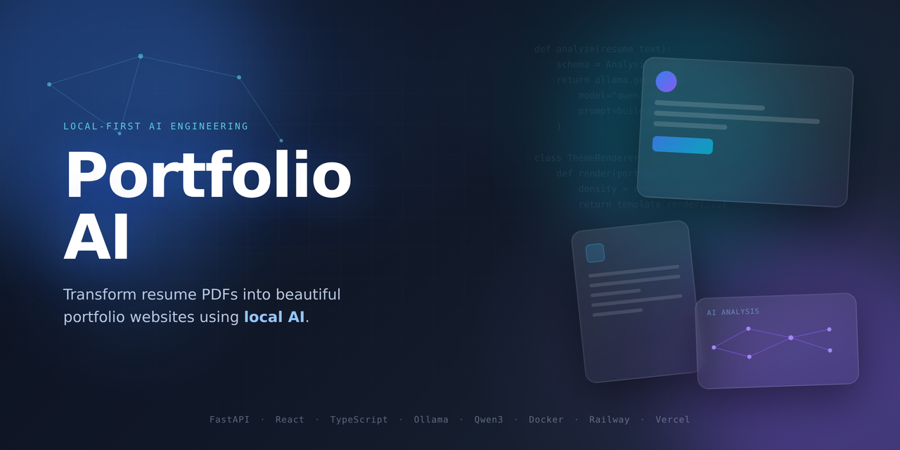
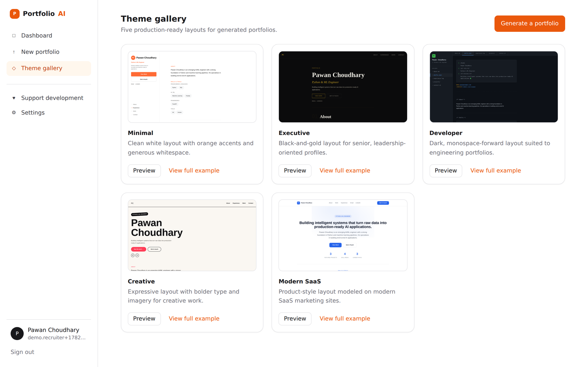
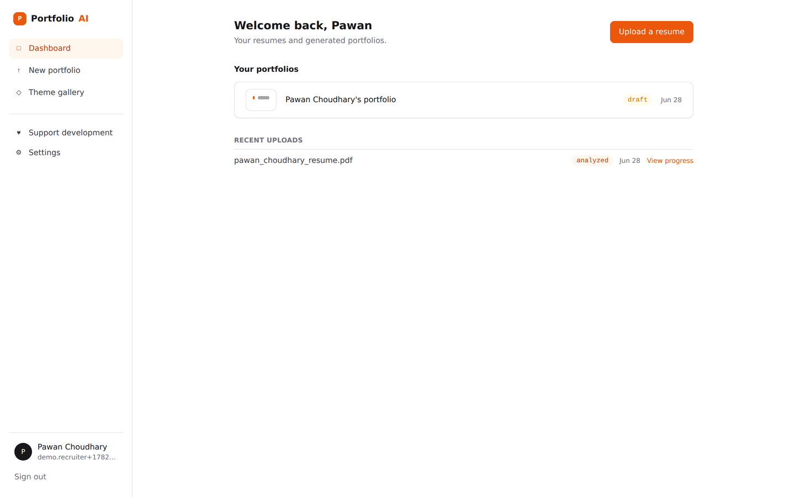
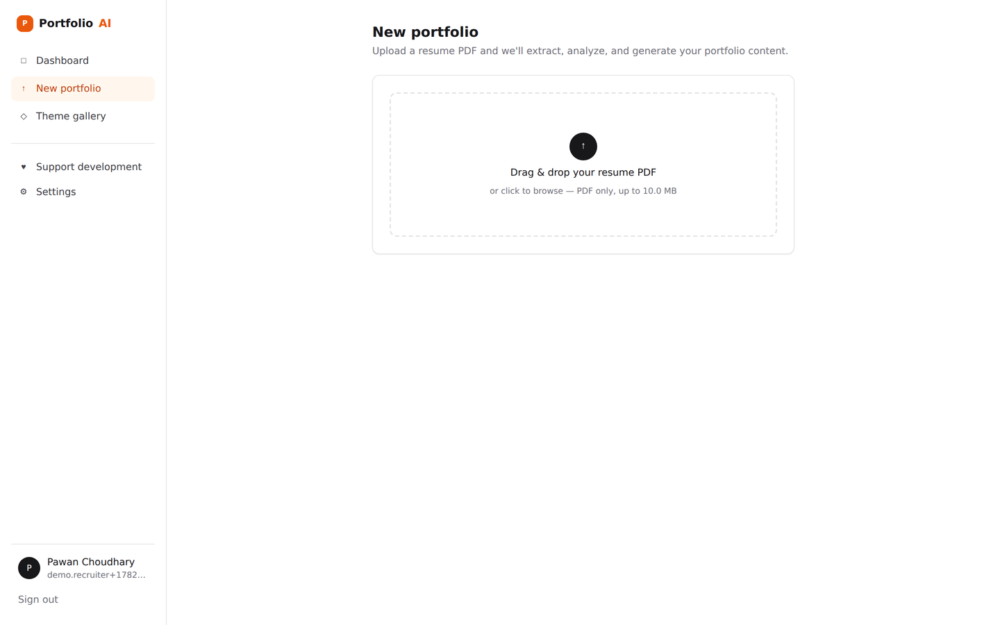
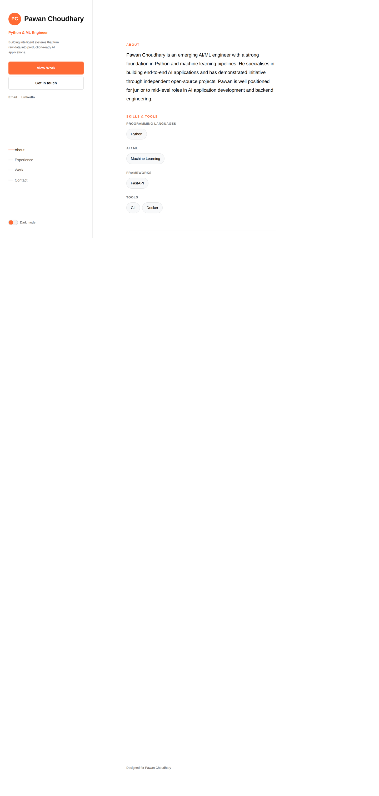
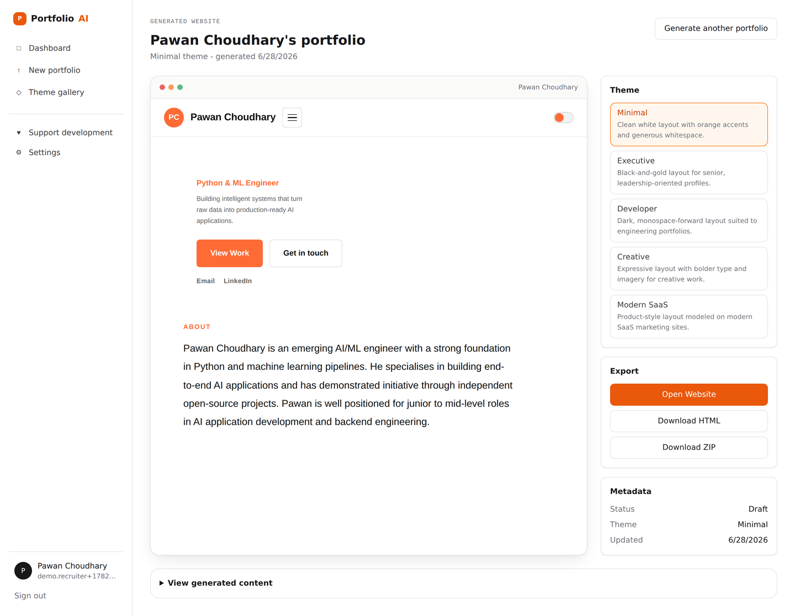
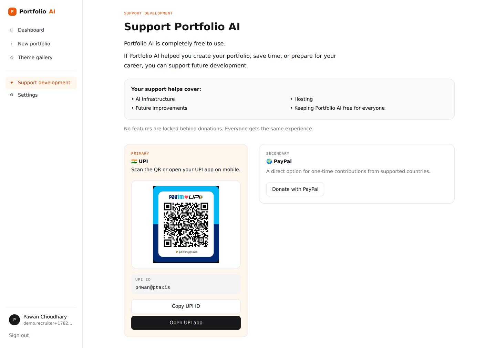
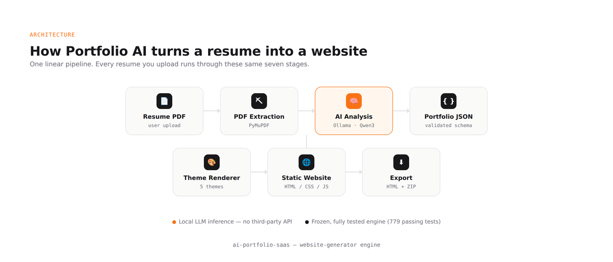

[](assets/banner.png)

# Portfolio AI

**Turn a resume PDF into a deployable portfolio website — analyzed by a local AI model, not a third-party API.**

[](https://fastapi.tiangolo.com/) [](https://react.dev/) [](https://ollama.com/) [](#tech-stack) [](#license)

**[Live Demo](https://ai-portfolio-generator-smoky.vercel.app/)** · **[API Docs (Swagger)](https://ai-portfolio-generator-production-8f9f.up.railway.app/docs)**

---

## Demo

[](assets/demo.gif)

Upload a resume → local AI analysis → pick a theme → portfolio generated → export.

---

## Why Portfolio AI?

Most "AI resume tools" send your resume to a third-party API. This one doesn't — resume analysis runs on Qwen3 through a locally-hosted Ollama server, on infrastructure you control. The output is a real static website with five genuinely different layouts, previewable instantly and exportable as HTML or a ZIP, with no separate deploy step required to see the result.

---

## Quick Features

[](assets/themes.png)

- ✅ **Resume Upload** — drag-and-drop PDF, validated by file signature, not just MIME type
- ✅ **Local AI Analysis** — Qwen3 via Ollama, never a third-party API
- ✅ **Five Themes** — Minimal, Executive, Developer, Creative, Modern SaaS — real layout changes, not palette swaps
- ✅ **Instant Theme Switching** — re-renders only, never re-runs extraction or AI analysis
- ✅ **Live Website Preview** — the generated site renders in-browser before you export anything
- ✅ **HTML / ZIP Export** — a single self-contained HTML file, or a zipped static site

---

## Project Stats

| Metric | Details |
|---|---|
| Engine Tests | 779 passing |
| Themes | 5 |
| Backend | FastAPI + SQLAlchemy + Alembic |
| Frontend | React 19 + TypeScript + Vite |
| AI Model | Qwen3 (local, via Ollama) |
| Deployment | Vercel + Railway (Docker) |

---

## How It Works

```
Resume PDF → Extract → AI Analysis → Portfolio JSON → Theme Renderer → Static Website → HTML / ZIP
```

Each stage above is independently tested — extraction, parsing, AI analysis, portfolio generation, and rendering each have their own suite under `website-generator/tests/`.

---

## Screenshots

| Dashboard | Upload |
|---|---|
| [](assets/dashboard.png) | [](assets/upload.png) |

| Theme Gallery | Generated Website |
|---|---|
| [](assets/themes.png) | [](assets/website-preview.png) |

| Results | Support |
|---|---|
| [](assets/results.png) | [](assets/support.png) |

---

## Architecture

[](assets/architecture.png)

A frozen, independently-tested engine (`website-generator/`) handles extraction, AI analysis, and theme rendering; the SaaS layer (`backend/` + `frontend/`) wraps it with auth, storage, and a dashboard — talking to it through exactly one file, `generator_service.py`, so the engine can change without the rest of the app ever knowing.

---

## Project Structure

```
ai-portfolio-saas/
├── backend/             FastAPI app — auth, resumes, portfolios, dashboard
├── frontend/            React + Vite SPA
├── website-generator/   Frozen AI/rendering engine — 779 passing tests
├── shared/              Cross-stack API types
├── docs/                Architecture & API reference
└── Dockerfile
```

---

## Installation

**Prerequisites:** Python 3.11+, Node 18+, [Ollama](https://ollama.com) (for real AI analysis)

```
git clone <this-repo-url>
cd ai-portfolio-saas

cd backend
python3 -m venv .venv && source .venv/bin/activate
pip install -r requirements.txt
cp .env.example .env
alembic upgrade head
uvicorn app.main:app --reload

cd ../frontend
npm install
cp .env.example .env
npm run dev
```

Backend → `localhost:8000/docs` · Frontend → `localhost:5173`

To enable real AI analysis: `ollama serve && ollama pull qwen3:14b`

---

## Deployment

| Vercel (Frontend) | Railway (Backend) | Docker |
|---|---|---|
| Root: `frontend/` · auto-deploys on push to `main` | Builds from root `Dockerfile` · health check at `/health` | `docker build -t portfolio-ai .` |

---

## Recruiter Highlights

- Strict isolation boundary — only one file (`generator_service.py`) is allowed to import the AI/rendering engine
- 779 passing tests on the engine, independent of the SaaS layer
- Local-first AI — resume data never leaves infrastructure you control
- Schema-validated AI responses, not raw LLM text trusted blindly
- Honest scaffolding — unfinished features (publish, drafts, version history) are explicit empty states, not silently broken half-built code

---

## Future Improvements

- [ ] One-click publish to a live URL
- [ ] Draft autosave
- [ ] Version history
- [ ] Visual theme editor
- [ ] Background task queue (Celery / RQ) in place of in-process background tasks

---

## License

MIT

---

**Pawan Choudhary**
