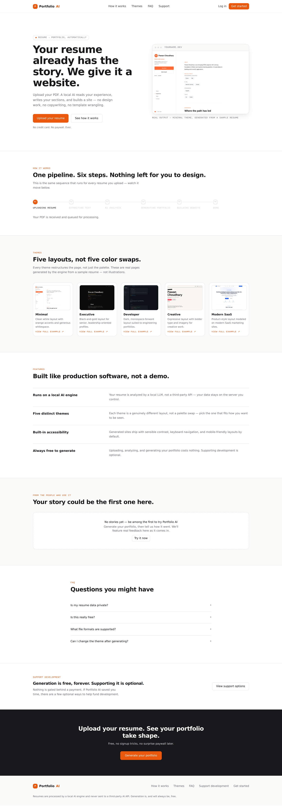
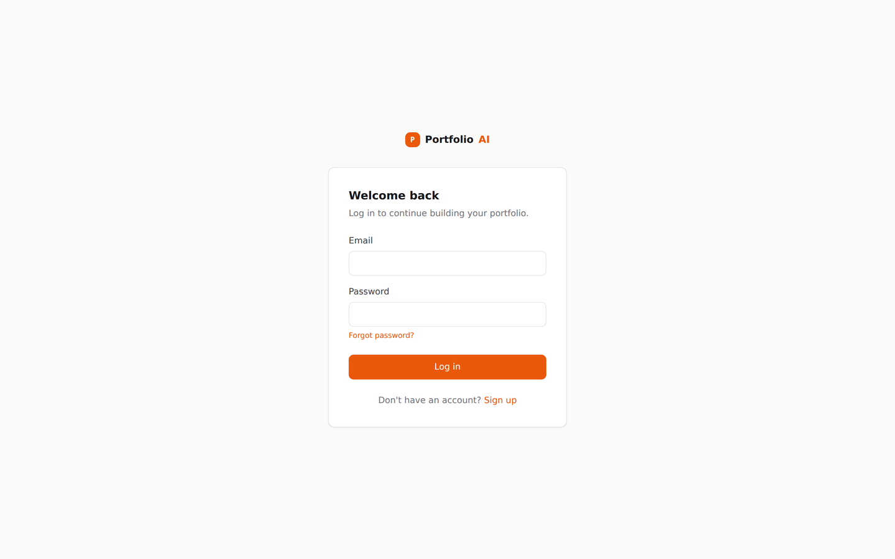
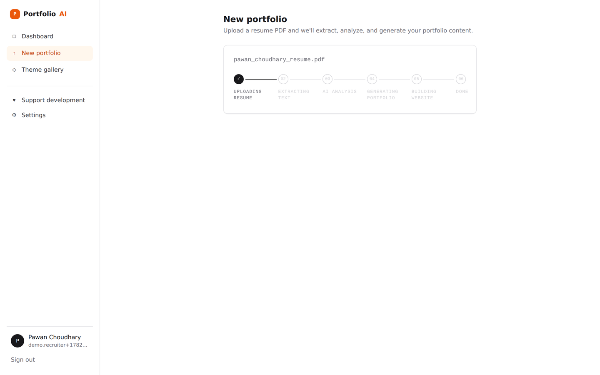

Portfolio AI

Turn a resume PDF into a real, deployable portfolio website — analyzed by a local AI model, not a third-party API.

Show Image
Show Image
Show Image
Show Image
Show Image
Show Image

Upload a PDF → a local Qwen3 model reads it → pick from five real themes → get a working static website, ready to download as HTML or a ZIP.

Live demo below · Architecture · API · Deploy it

Overview

Portfolio AI is a small SaaS built around one job: stop making people hand-build a portfolio site. You upload a resume PDF, a backend pipeline extracts the text, a locally-hosted LLM (Qwen3, via Ollama) turns it into structured portfolio content, and that content is rendered into one of five genuinely different theme layouts as a static website — viewable in-browser immediately, and exportable as a single HTML file or a ZIP.

It's split into two parts on purpose:

website-generator/ — a frozen, independently-tested engine (779 passing tests) that does the actual extraction → AI analysis → portfolio JSON → themed website work. It started life as a CLI tool and is never modified by the SaaS layer.
backend/ + frontend/ — the SaaS wrapper: accounts, uploads, a dashboard, theme switching, and exports, built on top of that engine through a single, deliberate isolation boundary (backend/app/services/generator_service.py).

Nothing here calls out to a third-party AI API. The model that reads your resume runs on infrastructure you control.

Features

Everything below is implemented and runnable today — not aspirational copy.

Email/password auth — signup, login, JWT-based sessions, and a forgot/reset-password flow with single-use, hashed reset tokens.
Drag-and-drop resume upload — PDF only, validated by both declared content-type and file signature (%PDF- magic bytes), capped at 10 MB.
A real, visible pipeline — upload → extract → AI analysis → generate portfolio content → render website → done, with live per-step status you can poll and watch resolve.
Five distinct themes, each a different layout (not a palette swap): Minimal, Executive, Developer, Creative, and Modern SaaS.
Instant theme switching — re-rendering an already-generated portfolio in a different theme replays only the rendering step; it never re-runs extraction, AI analysis, or content generation.
A live, in-browser website preview — the actual generated site renders in an iframe on the results page, and "Open Website" opens the real standalone HTML in a new tab.
Export as HTML or ZIP — download the generated site as a single self-contained HTML file (CSS inlined) or a ZIP of the rendered output.
An adaptive rendering layer in the engine — the website generator classifies each portfolio's content density (sparse/medium/dense) and adjusts spacing and which UI affordances show, so a one-project resume doesn't get the same padding and bragging copy as a five-project one.
A real donation page — UPI (with QR + deep link) and PayPal, because generation itself is free and always will be.

Not implemented (yet)

The database schema already has tables for Draft, PublishedSite, and VersionHistory, and the dashboard already has UI sections for them — but no route currently writes to them. There is no one-click publish/deploy, no draft autosave, and no version history yet. This is intentional scaffolding for future milestones, not a hidden feature; the dashboard simply shows empty states for these sections today.

Screenshots

<table>
<tr>
<td width="50%">
Login
</td>
<td width="50%">
Dashboard
</td>
</tr>
<tr>
<td width="50%">
Upload
</td>
<td width="50%">
Processing pipeline
</td>
</tr>
<tr>
<td width="50%">
Results — live preview + theme switch + export
</td>
<td width="50%">
Theme gallery
</td>
</tr>
<tr>
<td width="50%">
The actual generated website
</td>
<td width="50%">
Support page (real UPI + PayPal)
</td>
</tr>
</table>

Architecture

Browser (React SPA)
   │  fetch/XHR, JWT in Authorization header
   ▼
FastAPI app (backend/app/main.py)
   │
   ├─ /api/v1/auth        → services/auth_service.py     → User, PasswordResetToken
   ├─ /api/v1/dashboard   → read-only aggregation        → Resume, Portfolio, PublishedSite, VersionHistory
   ├─ /api/v1/resumes     → services/resume_service.py   ─┐
   └─ /api/v1/portfolios  → services/generator_service.py ┘
                                      │
                                      ▼  (the ONLY file that imports website-generator/src)
                        website-generator/  (frozen engine, untouched, 779 passing tests)

Frontend — a React 19 + TypeScript SPA (Vite, React Router, Tailwind). AuthContext holds the logged-in user and JWT; ProtectedRoute gates everything past the public marketing pages; AppShell is the persistent sidebar.

Backend — FastAPI over SQLite (via SQLAlchemy + Alembic). Stateless JWT auth (python-jose), bcrypt for password hashing. Routes stay thin; the actual logic lives in services/.

AI pipeline — website-generator/src/ai/: a resume's raw text is sent to a local Ollama server (OllamaClient.generate), the response is validated against a strict schema (analysis_schema.py, validators.py), and the structured analysis feeds portfolio generation.

Storage — uploaded PDFs live under backend/storage/resumes/<user_id>/; rendered website exports live under backend/storage/exports/<portfolio_id>/<theme>/. Both are local-filesystem today, isolated behind storage_service.py so swapping to S3/GCS later is a one-file change.

Export engine — backend/app/api/routes/portfolios.py renders the saved portfolio_schema_json through the engine's theme renderer on demand (in-memory for HTML, on-disk + zipped for ZIP) — nothing is pre-rendered and stored permanently per theme.

Theme engine — website-generator/src/website/theme_renderers.py + templates/<theme>/ (one index.html + styles.css per theme). content_density.py classifies the portfolio as sparse/medium/dense and sets a data-density attribute the theme CSS reads.

Authentication — JWT bearer tokens (24h expiry by default), issued on signup/login, validated per-request via a FastAPI dependency (core/dependencies.py). Forgot-password issues a single-use, hashed, time-limited token; the plaintext token is never stored.

Resume parsing — PyMuPDF (fitz) extracts raw text (src/extraction/pdf_extractor.py); a lightweight parser (src/parsing/) detects sections and normalizes them into a ResumeSchema before anything touches the LLM.

Portfolio generation — src/portfolio/portfolio_generator.py prompts the LLM for hero copy, About, skills, and project sections, validates the response shape, and produces a PortfolioSchema.

Website generation — src/website/website_generator.py takes the PortfolioSchema and a theme name and renders static index.html + styles.css.

Downloads — GET /portfolios/{id}/export/html (single HTML file, CSS inlined, Content-Disposition: attachment) and GET /portfolios/{id}/export/zip (zipped rendered output).

Support page — a real UPI ID + QR code and a real PayPal link, configured via frontend env vars, not hardcoded.

Folder structure

ai-portfolio-saas/
├── backend/                      FastAPI app
│   ├── app/
│   │   ├── api/routes/           auth.py, dashboard.py, resumes.py, portfolios.py
│   │   ├── core/                 config.py, security.py, dependencies.py
│   │   ├── database/             models.py, session.py
│   │   ├── schemas/              auth.py, dashboard.py, portfolio.py, resume.py
│   │   ├── services/             auth_service.py, resume_service.py,
│   │   │                         storage_service.py, generator_service.py
│   │   └── main.py
│   ├── alembic/                  migrations (versions/5e2847fbfc22_initial_schema.py)
│   ├── storage/                  resumes/, exports/  (gitignored contents)
│   ├── data/                     app.db (gitignored)
│   ├── .env.example
│   └── requirements.txt
│
├── frontend/                     React + Vite + TypeScript SPA
│   ├── src/
│   │   ├── pages/                LandingPage, SignUpPage, LoginPage, ForgotPasswordPage,
│   │   │                         DashboardPage, UploadPage, ResultsPage,
│   │   │                         ThemeGalleryPage, SupportPage, SettingsPage
│   │   ├── components/           AppShell, AuthLayout, Button, Card, EmptyState, ErrorState,
│   │   │                         LiveProcessingStrip, PipelineStrip, ProgressBar,
│   │   │                         ProtectedRoute, ThemePreview, ThemeSwatch, UploadDropzone, ...
│   │   ├── context/               AuthContext.tsx
│   │   ├── api/                  client.ts
│   │   └── lib/                  status.ts, theme.ts
│   ├── public/
│   │   ├── theme-previews/       bundled demo preview images for all 5 themes
│   │   └── assets/payments/      upi-qr.png
│   ├── .env.example
│   └── package.json
│
├── shared/
│   └── types.ts                  the API contract — mirrors backend Pydantic schemas
│
├── website-generator/            Frozen CLI engine — never modified by the SaaS layer
│   ├── src/
│   │   ├── extraction/           pdf_extractor.py, validator.py
│   │   ├── parsing/               resume_parser.py, section_detector.py, normalizer.py
│   │   ├── ai/                   ollama_client.py, analyzer.py, prompts.py, validators.py
│   │   ├── portfolio/             portfolio_generator.py, portfolio_schema.py, portfolio_validator.py
│   │   └── website/               website_generator.py, theme_renderers.py, content_density.py,
│   │                              templates/<5 themes>/
│   ├── tests/                    779 passing tests across ai/, extraction/, parsing/, portfolio/, website/
│   ├── scripts/                  generate_theme_previews.py, test_extraction.py
│   └── main.py                   CLI entry point
│
├── docs/
│   └── ARCHITECTURE.md
├── CHANGELOG.md
└── README.md

Installation

Requires Python 3.11+, Node 18+, and (optionally, for the AI step) a local Ollama install.

Linux / macOS

bashgit clone <this-repo-url>
cd ai-portfolio-saas

# Backend
cd backend
python3 -m venv .venv && source .venv/bin/activate
pip install -r requirements.txt
cp .env.example .env
python3 -m alembic upgrade head
cd ..

# Frontend
cd frontend
npm install
cp .env.example .env
cd ..

Windows (PowerShell)

powershellgit clone <this-repo-url>
cd ai-portfolio-saas

# Backend
cd backend
python -m venv .venv
.venv\Scripts\Activate.ps1
pip install -r requirements.txt
copy .env.example .env
python -m alembic upgrade head
cd ..

# Frontend
cd frontend
npm install
copy .env.example .env
cd ..

The AI step (optional, but needed for real AI analysis)

bashollama serve
ollama pull qwen3:14b   # or whatever OLLAMA_MODEL is set to in backend/.env

Without Ollama running, uploads still go through extraction successfully and then fail — visibly, in the UI — at the AI analysis step. That's expected, not a bug.

Environment Variables

backend/.env

VariableDefaultPurposeENVIRONMENTdevelopmentFree-text environment label.DEBUGtrueFastAPI debug behavior.DATABASE_URLsqlite:///./data/app.dbSQLAlchemy connection string. Swap for a Postgres DSN in production.JWT_SECRET_KEY(dev placeholder — change this)Signing key for access tokens.JWT_ALGORITHMHS256JWT signing algorithm.ACCESS_TOKEN_EXPIRE_MINUTES1440 (24h)Access token lifetime.PASSWORD_RESET_TOKEN_EXPIRE_MINUTES30Forgot-password token lifetime.MAX_UPLOAD_SIZE_BYTES10485760 (10 MB)Resume upload size cap.OLLAMA_HOSThttp://localhost:11434Where the backend looks for Ollama.OLLAMA_MODELqwen3:14bModel name passed to Ollama's /api/generate.OLLAMA_TIMEOUT_SECONDS120Request timeout for AI analysis/generation calls.

CORS_ORIGINS (defaults to the Vite dev server's two localhost variants) is set in app/core/config.py rather than .env, since pydantic-settings doesn't parse comma-separated env lists by default — override it with a JSON array string if you need to (e.g. CORS_ORIGINS=["https://yourapp.vercel.app"]).

frontend/.env

VariableDefaultPurposeVITE_API_BASE_URLhttp://localhost:8000/api/v1Backend base URL the SPA calls.VITE_SUPPORT_PAYPAL_URLa real paypal.me linkPayPal donation link on the Support page.VITE_SUPPORT_UPI_IDa real UPI IDUPI ID shown/copied on the Support page.VITE_SUPPORT_PAYEE_NAMEPortfolio AIPayee name used in the UPI deep link.

Running locally

Backend

bashcd backend
source .venv/bin/activate   # .venv\Scripts\Activate.ps1 on Windows
uvicorn app.main:app --reload --port 8000

API docs at http://localhost:8000/docs. Health check at GET /health.

Frontend

bashcd frontend
npm run dev

App at http://localhost:5173.

Production build

bashcd frontend
npm run build      # tsc -b && vite build → frontend/dist
npm run preview    # serve the production build locally

The backend has no separate build step — run the same uvicorn command behind a production ASGI setup (e.g. uvicorn app.main:app --host 0.0.0.0 --port 8000 behind a process manager), and point DATABASE_URL at Postgres instead of SQLite.

Deployment

This repo doesn't ship a vercel.json or Railway config — the steps below are how to deploy it on Vercel (frontend) + Railway (backend), which line up cleanly with this codebase's split.

Frontend (Vercel)

Connect GitHub — in Vercel, "Add New Project" → import this repository.
Root directory: set it to frontend/ (Vercel builds from a subfolder fine).
Build command: npm run build. Output directory: dist.
Environment variables: add VITE_API_BASE_URL pointing at your deployed backend (e.g. https://your-api.up.railway.app/api/v1), plus the three VITE_SUPPORT_* variables if you want your own donation links.
Automatic deployments: once connected, every push to main triggers a new Production Deployment automatically — no manual redeploys, no URLs to update.
Preview Deployments: every push to any other branch or pull request gets its own unique preview URL automatically, so you can review changes before merging.
Production Deployments: merges to main (or whichever branch you set as Production Branch in Project Settings → Git) promote straight to your production URL.
Rollback: in the Deployments tab, any previous deployment has a "..." menu → "Promote to Production" — this swaps production back instantly without a new build.

Backend (Railway)

New Project → "Deploy from GitHub repo" → select this repository.
Root directory: backend/.
Start command: uvicorn app.main:app --host 0.0.0.0 --port $PORT.
Persistent storage: attach a Railway Volume mounted at backend/storage (and backend/data if staying on SQLite) so uploaded resumes and exports survive redeploys. For real production use, switch DATABASE_URL to Railway's managed Postgres instead of file-based SQLite, since container filesystems aren't guaranteed to persist across every deploy without a volume.
Environment variables: set JWT_SECRET_KEY (a real random secret — never reuse the dev default), DATABASE_URL, CORS_ORIGINS (to your Vercel frontend URL), and the OLLAMA_* variables if you're pointing at a hosted or sidecar Ollama instance.
Custom domain: Railway → Settings → Domains → add your domain and point a CNAME at the generated Railway domain.
Health checks: point Railway's health check at GET /health (already implemented in app/main.py, returns {"status": "ok"}).

GitHub Integration

Connecting both Vercel and Railway to the same GitHub repository means:

Every push to main redeploys both frontend and backend automatically — no manual trigger, no URL ever needs to change.
The production URL stays constant; only what's running behind it changes.
Pull requests get their own preview deployments on Vercel automatically, separate from production.

In the repository's GitHub settings, it's worth enabling branch protection on main (require a passing build/PR review before merge) so nothing untested reaches the branch that auto-deploys to production.

Continuous Deployment

GitHub (main branch push)
   ├──► Vercel: build (npm run build) → Production Deployment → same production URL
   └──► Railway: build → restart service → same production URL

Both platforms keep build logs per-deployment (Vercel: Deployments → a deployment → "Build Logs"; Railway: a deployment → "Logs"), and both support one-click rollback to a previous build if a deploy misbehaves. Treat main as the only branch either platform watches for production — everything else only ever produces previews, which is what keeps production safe from in-progress work.

AI Pipeline

Resume PDF
    │  PyMuPDF text extraction (src/extraction/pdf_extractor.py)
    ▼
Raw text → ResumeSchema
    │  section detection + normalization (src/parsing/)
    ▼
AI Analysis
    │  local Ollama call (Qwen3), validated against analysis_schema.py
    ▼
Portfolio JSON
    │  src/portfolio/portfolio_generator.py → PortfolioSchema
    ▼
Theme Renderer
    │  src/website/theme_renderers.py + content_density classification
    ▼
Static Website (HTML + CSS)
    │
    ▼
HTML + ZIP Export

Each arrow is a real, separately-tested stage — extraction, parsing, AI analysis, portfolio generation, and website rendering each have their own test suite under website-generator/tests/.

Theme System

Five themes live in website-generator/src/website/templates/, each its own index.html + styles.css: Minimal (white/orange), Executive (black/gold), Developer (dark, monospace), Creative (bolder type/imagery), and Modern SaaS (product-marketing style).

Previews: the Theme Gallery page renders each theme against a bundled demo portfolio (frontend/public/theme-previews/*.png, plus a live GET /portfolios/themes/{theme}/demo-website endpoint that renders the engine's own test fixture through the real theme renderer).
Switching: on the Results page, picking a different theme calls POST /portfolios/{id}/theme-preview, which re-renders the same saved portfolio_schema_json through the new theme and updates Portfolio.selected_theme — extraction, AI analysis, and content generation never re-run.
Adaptive layout: content_density.py scores each portfolio's content (projects weighted heaviest) and classifies it sparse/medium/dense, setting a data-density attribute each theme's CSS reads to scale spacing and decide whether volume-bragging UI (like Modern SaaS's stats row) makes sense to show.

Export System

ActionEndpointWhat you getLive previewGET /portfolios/{id}/website?theme=...Rendered HTML (CSS inlined), shown in the Results page iframe and via "Open Website"Download HTMLGET /portfolios/{id}/export/html?theme=...A single .html file, CSS inlined, served as an attachmentDownload ZIPGET /portfolios/{id}/export/zip?theme=...The rendered theme output, zipped, served as <title>-<theme>.zip

All three render on demand from the saved portfolio_schema_json — nothing is pre-baked, and a portfolio with no real content yet (status not draft/published, or no schema) returns 409 Conflict rather than a broken file.

Security

Authentication: stateless JWTs (HS256), 24h expiry by default, validated per-request via core/dependencies.py. No session state server-side beyond the DB row for the user itself.
Password storage: bcrypt directly (not via passlib, to avoid a known passlib/bcrypt version-compatibility issue), 10 hash rounds by default.
Password reset: tokens are single-use and time-limited; only the hash of the token is stored, and it's matched with a loop over unused/unexpired rows rather than a direct lookup, so a database read alone can't be replayed into an account takeover. The forgot-password endpoint responds identically whether or not an account exists, so it can't be used to enumerate registered emails.
Input validation: uploads are checked against both the client-supplied Content-Type and the actual file signature (%PDF- magic bytes) before being accepted — the header alone is trivially spoofed.
Protected routes: every route except auth/public marketing pages requires a valid bearer token (ProtectedRoute on the frontend, get_current_user dependency on the backend); resumes/portfolios are always scoped to current_user.id, never fetched by ID alone.
No internal leakage: raw engine exceptions (which can embed server filesystem paths or the Ollama host/model name) are translated to plain client-safe messages at the generator_service.py boundary and logged server-side only. The llm_model field is stripped from every portfolio response before serialization, so which AI model generated the content is never exposed to the client.
Secrets: JWT_SECRET_KEY ships with an obvious dev-only placeholder and must be overridden before any real deployment; .env files are gitignored.

Performance

Frontend: Vite + React 19, route-level pages with no large client-side bundling beyond Tailwind's generated CSS; skeleton loading states avoid blank-screen waits while dashboard/resume data is fetched.
Backend: the upload pipeline runs via FastAPI BackgroundTasks — adequate for local dev and one user at a time, but each Ollama call can take real seconds and ties up a request worker; the code includes an explicit note that production traffic should move this to a real task queue (Celery/RQ/Arq) instead.
Rendering: theme re-rendering on switch only re-runs the (fast) templating step, never the AI calls — switching themes is effectively instant compared to generating a portfolio from scratch.
Database: SQLite for local dev with indexed foreign keys (user_id, resume_id, portfolio_id); swapping DATABASE_URL to Postgres is the documented path for concurrent production traffic.

Tech Stack

Backend: FastAPI 0.115, SQLAlchemy 2.0, Alembic 1.13, Pydantic 2.9, python-jose[cryptography], bcrypt, python-multipart, email-validator, Uvicorn.

Frontend: React 19, React Router 7, TypeScript ~6.0, Vite 8, Tailwind CSS 3.4, oxlint.

AI/Engine (website-generator/): Python 3.11+, Pydantic 2.7, PyMuPDF (fitz) 1.24, ollama Python client 0.2, Streamlit (engine's own standalone UI entry point, separate from this SaaS's React frontend).

Shared: a hand-maintained shared/types.ts mirroring the backend's Pydantic schemas — the API contract both sides build against.

API Overview

All routes below are mounted under /api/v1. Authenticated routes require Authorization: Bearer <token>.

Auth (/auth)

MethodPathDescriptionPOST/auth/signupCreate an account, returns a token + user.POST/auth/loginLog in, returns a token + user.GET/auth/meCurrent authenticated user.POST/auth/forgot-passwordRequest a reset token (always 200, regardless of whether the email exists).POST/auth/reset-passwordReset a password using a valid token.

Dashboard (/dashboard)

MethodPathDescriptionGET/dashboard/overviewRecent resumes, generated portfolios, published sites, drafts, and version history (the latter three are currently always empty — see Features).

Resumes (/resumes)

MethodPathDescriptionPOST/resumesUpload a PDF (multipart file); kicks off the background pipeline.GET/resumesList your resumes.GET/resumes/{id}Get one resume.GET/resumes/{id}/statusPoll pipeline step statuses + the resulting portfolio_id once ready.

Portfolios (/portfolios)

MethodPathDescriptionGET/portfolios/themes/catalogThe five-theme catalog (value/label/description).GET/portfolios/themes/{theme}/demo-websiteA rendered demo of one theme, using the engine's own fixture data.GET/portfoliosList your portfolios.GET/portfolios/{id}Full portfolio detail, including generated content.POST/portfolios/{id}/theme-previewRe-render the portfolio in a different theme; updates the selected theme.GET/portfolios/{id}/websiteThe live rendered website (HTML, CSS inlined).GET/portfolios/{id}/export/htmlDownload as a single HTML file.GET/portfolios/{id}/export/zipDownload as a ZIP.

Health

MethodPathDescriptionGET/health{"status": "ok"} — unauthenticated, for uptime/health checks.

Full interactive docs (request/response schemas, "try it out") are auto-generated by FastAPI at /docs whenever the backend is running.

Roadmap

These map directly to the unused-but-already-modeled Draft, PublishedSite, and VersionHistory tables and dashboard sections:

One-click publish — turn a PublishedSite row from schema into an actual deploy target with a real slug/URL.
Draft autosave — let in-progress edits live in Draft before becoming the active Portfolio.
Version history — surface VersionHistory rows so regenerating a portfolio doesn't silently discard the previous version.
A visual theme editor — beyond picking a preset theme, light customization (accent color, section order) within a theme.
A real task queue for the upload pipeline (Celery/RQ/Arq) instead of in-process BackgroundTasks, for concurrent multi-user load.
OpenAPI-generated shared/types.ts instead of hand-mirrored types, once the API surface grows past what's comfortable to keep in sync by hand.

FAQ

Uploads fail at "Analyzing resume with AI" — is something broken?
No — that step needs a local Ollama server running with the model named in OLLAMA_MODEL pulled. Run ollama serve and ollama pull qwen3:14b (or your configured model), then re-upload.

Why SQLite instead of Postgres?
SQLite is the local-dev default for zero-setup friction. DATABASE_URL is the only thing that needs to change for Postgres — nothing else in the codebase assumes SQLite specifically.

The frontend can't reach the backend (CORS / network errors).
Confirm backend/.env's CORS_ORIGINS (in app/core/config.py) includes your frontend's actual origin, and that frontend/.env's VITE_API_BASE_URL points at the right backend host/port.

Why does my upload fail with "This file isn't a valid PDF"?
The backend checks the actual file signature, not just the browser's reported content type — a renamed non-PDF file will be rejected even if it has a .pdf extension.

Can I use a different Ollama model?
Yes — set OLLAMA_MODEL in backend/.env to any model you've pulled. The prompts in website-generator/src/ai/prompts.py are model-agnostic, but response quality/shape will vary by model.

Contributing

Fork the repo and create a branch off main (git checkout -b feature/your-change).
Keep website-generator/ changes isolated and run its suite before opening a PR:

bash   cd website-generator
   pip install -r requirements.txt -r requirements-dev.txt
   pytest

For backend/frontend changes, make sure uvicorn app.main:app --reload and npm run dev both still start cleanly, and run npm run lint in frontend/.
Open a PR against main with a clear description of what changed and why. Vercel/Railway (if connected) will build a preview automatically — link it in the PR.
Keep the isolation boundary intact: only backend/app/services/generator_service.py should ever import from website-generator/src.

License

MIT — see the LICENSE file (or add one if it's missing; none was found in this audit).

Credits

Built around the website-generator engine's local-first approach: resumes are analyzed by a self-hosted Qwen3 model via Ollama, not a third-party AI API. Theme designs, the adaptive content-density layer, and the SaaS layer in backend//frontend/ are all part of this same project.
